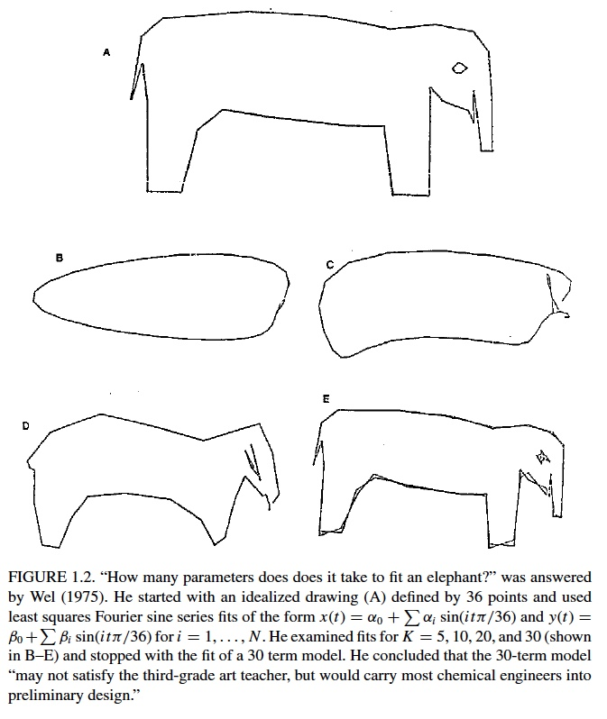

```{r setup, include=FALSE}
knitr::opts_chunk$set(echo = TRUE)
packages_needed <- c("ggplot2", # graphics
                     "dplyr",
                     "lme4", # display() etc.
                     "lmerTest",
                     "MuMIn"
                     )
pk_to_install <- packages_needed [!( packages_needed %in% rownames(installed.packages())  )]
if(length(pk_to_install)>0 ){
  install.packages(pk_to_install,repos="http://cran.r-project.org")
}
#lapply(packages_needed, require, character.only = TRUE)
library(ggplot2)
library(dplyr)
library(lme4)
library(lmerTest)
library(ggfortify)
library(MuMIn)
```

```{r include = FALSE}
knitr::opts_chunk$set(warning = FALSE, message = FALSE)
```
\
Much of this material is from James Santangelo:
https://uoftcoders.github.io/rcourse/

Excellent video here:
https://www.youtube.com/watch?v=7XAHjm6Vy5k

## Background

Up to now, when faced with a biological question, we have formulated a null hypothesis, generated a model to test the null hypothesis, summarized the model to get the value of the test-statistic (e.g. _t_-statistic, _F_-value, etc.), and rejected the null hypothesis when the observed test statistic falls outside the test statistic distribution with some arbitrarily low probability (e.g. _P_ < 0.05). This low probability then allows us to reject the null hypothesis in favour of the more biologically interesting alternative hypothesis. 

This is an **inferential** or **frequentist** approach to statistics. An alternative approach is to simultaneously test **multiple competing hypotheses**, with each hypothesis being represented in a separate model. This is what model selection allows and it is becoming increasingly popular. It has a number of advantages:

1. It does not rely on a single model.
2. Models can be ranked and weighted according to their fit to the observed data.
3. The best supported models can be averaged to get parameter estimates
    
The most challenging part of model selection is coming up with a series of hypothesis-driven models that adequately capture the processes and patterns you are interested in representing. In an ideal world, this would be based on detailed knowledge of the system you are working in and on prior work or literature reviews. However, detailed knowledge is often unavailable for many ecological systems and alternative approaches exist. For example, we can compare models with all possible combinations of the predictors of interest (aka the **all-subset** approach) rather than constructing models with only particular combinations of those predictors. Note this approach has been criticized as "data-dredging" or "fishing" (Burnham and Anderson 2002, but see Symonds and Moussalli 2011) and is nicely summarized but this often-quote line from Burnham and Anderson (2012).

_"“Let the computer find out” is a poor strategy and usually reflects the fact that the researcher did not bother to think clearly about the problem of interest and its scientific setting (Burnham and Anderson, 2002)."_

The next step is to decide how we select the "best" model or set of best models. One approach would be to use a measure of model fit or explanatory power. For example, we could use the model R^2^, which represents the amount of variation in our response variable that is explained by the predictor variables in the model. However, this is not a parsimonious solution since it inevitably favours more complex models (i.e. models with more predictors). Thus, what we really need is an approach that examines model fit while simultaneously penalizing model complexity.

This trade-off between complexity and explanatory power (model fit) is at the heart of model selection.



This is also closely related to the concept of **parsimony**; principle that suggests that all things being equal, you should prefer the simplest possible explanation for a phenomenon or the simplest possible solution to a problem. Since parsimonious explanations are simpler, they tend to generalize better across a wide range of situations. This means that a parsimonious explanation will generally be better able to explain a wider range of phenomena than a less parsimonious one, since a parsimonious explanation doesn’t rely on as many assumptions that are specific to the situation at hand.  


\
\

## Information Theory and Model Selection Criteria

There are numerous model selection criteria based on mathematical information theory that we can use to select among a set of candidate models. They additionally allow the relative weights of different models to be compared and allow multiple models to be used for inferences. The most commonly used information criteria in ecology and evolution are: Akaike's Information Criterion (AIC), the corrected AIC~c~ (corrected for small sample sizes), and the Bayesian Information Criterion (BIC, also known as the Schwarz Criterion; Johnson and Omland, 2004). Here we will focus on AIC and AIC~c~. Here is how AIC is calculated:

$$ AIC = -2Log\mathcal{L} \ + \ 2p $$
The lower the AIC value, the better the model. $-2Log\mathcal{L}$ is called the **negative log likelihood** of the model, and measures the model's fit (or lack thereof) to the observed data: **Lower** negative log-likelihood values indicate a better fit of the model to the observed data. $2p$ is a _bias correcting factor_ that penalizes the model AIC based on the number of parameters (p) in the model. 

Similar to AIC is AIC~c~, which corrects for small sample sizes. It is recommended to use AIC~c~ when $n/k$ is less than 40, with $n$ being the sample size (i.e. total number of observations) and $k$ being the number of parameters in the most saturated model (i.e. the model with the most parameters; Symonds and Moussalli 2011). AIC~c~ is calculated as follows:

$$ AIC_c = AIC+\frac{2k(k+1)}{n-k-1} $$

## Caveats and Limitations to Model Selection

1. Depends on the models included in the candidate set. You can’t identify a model as being the “best” fit to the data if you didn’t include the model to begin with!  
\
2. The parameter estimates and predictions arising from the “best” model or set of best models should be biologically meaningful.  
\
3. Need to decide whether to use model selection or common inferential statistics (e.g. based on P-values). Techniques that rely on both approaches are possible (e.g. backward variable selection followed by averaging of top models) but are discouraged by some model-selection purists.  
\
4. Difficult or impossible to compare models with different assumptions, such as those with different error structures (e.g., Poisson vs. Binomial data).  