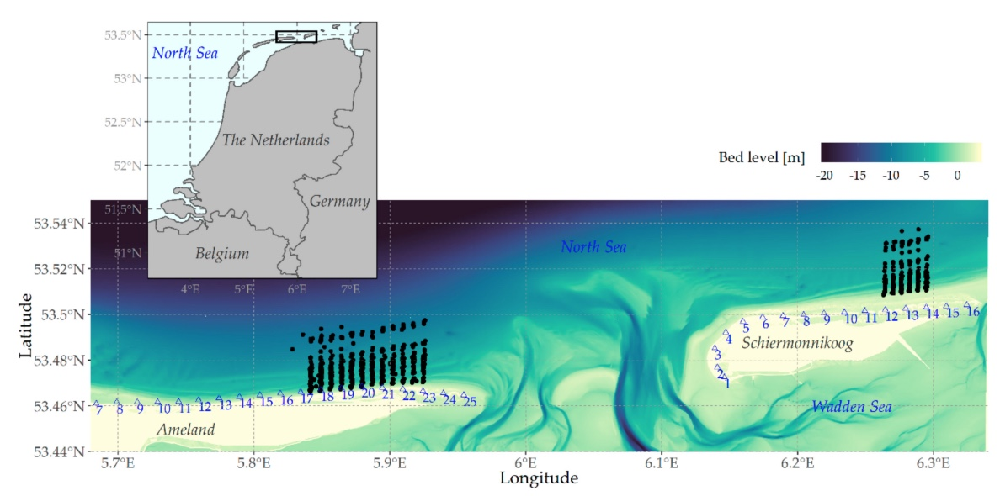
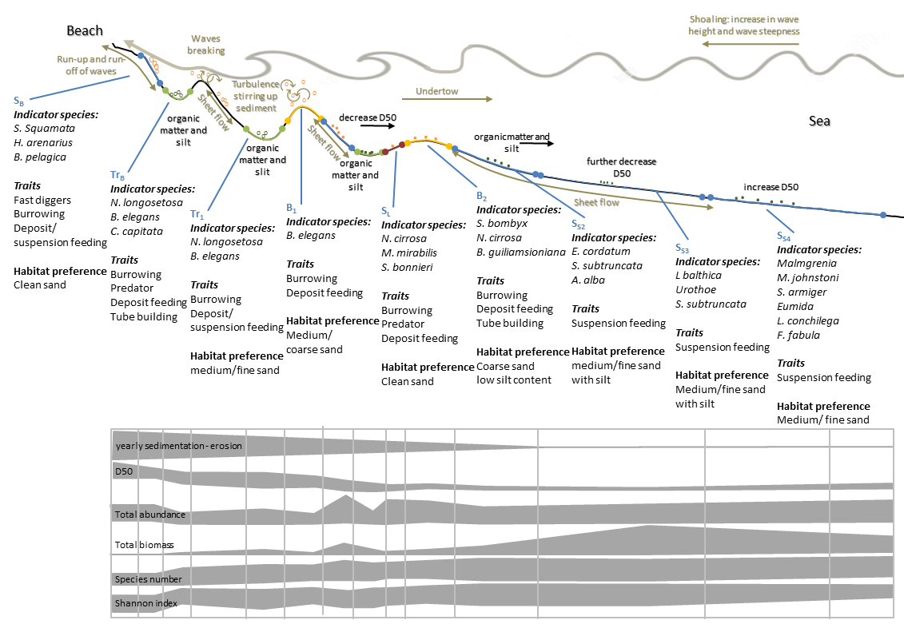

```{r setup, include=FALSE}
knitr::opts_chunk$set(echo = TRUE)
packages_needed <- c("ggplot2", # graphics
                     "dplyr",
                     "lme4", # display() etc.
                     "lmerTest",
                     "MuMIn"
                     )
pk_to_install <- packages_needed [!( packages_needed %in% rownames(installed.packages())  )]
if(length(pk_to_install)>0 ){
  install.packages(pk_to_install,repos="http://cran.r-project.org")
}
#lapply(packages_needed, require, character.only = TRUE)
library(ggplot2)
library(dplyr)
library(lme4)
library(lmerTest)
library(ggfortify)
library(MuMIn)
```

```{r include = FALSE}
knitr::opts_chunk$set(warning = FALSE, message = FALSE)
```

```{r adjust width of console outputs, include=FALSE}
#many of our tables output in the console are really wide; expand limits [width] to fit them all in,
#otherwise they wrap awkwardly
options(width = 90)
#https://bookdown.org/yihui/rmarkdown-cookbook/text-width.html

#matrix(runif(100), ncol = 20) #test code to display adjusted width
```


The Dutch have fought great battles with the North Sea in order to extend their landmass as can be witnessed by the presence of dykes and sophisticated coastal defence systems. The effect of sea level rise on the ecology of the Dutch coastal system constitutes a serious issue.

The Dutch governmental institute RIKZ started a research project on
the relationship between some abiotic aspects of beaches (e.g., sediment composition, slope
of the beach) that might affect benthic fauna. Nine beaches were chosen by stratifying levels of exposure: three beaches with high exposure, three beaches with medium exposure and three beaches with low exposure. Sampling was carried out at each beach and five sampling station sites were selected at each beach.

**Richness** is the number of benthic taxa present.  
**NAP** is the height of the sampling station relative to mean sea level.  
**Exposure** is an index that is composed of wave action, length of the surf zone, slope, grain size, and depth of the anaerobic layer.



```{r message=FALSE, warning=FALSE}
# Load in data
rikz_data <- read.csv("../data/rikz_data.csv")
```

```{r}
rikz_data$Beach <- as.factor(rikz_data$Beach)
str(rikz_data)
```
## Example of model selection: RIKZ

We can use mixed-effect models to determine whether species richness is influenced by NAP (i.e. the height of a sampling location relative to mean tidal level) across 9 beaches. 

We generated 3 models: 

1. A **random intercept model** with NAP as a fixed effect and the random effect allowing the intercept (i.e species richness) to vary by beach; 

2. A **random intercept and slope model** with NAP as a fixed effect and a random effect allowing both the intercept (i.e. richness) and slope (i.e. response of richness to NAP) to vary across beaches; and 

3. An **intercept only model** with no fixed effects but allowing for variation in richness across beaches. We'll create similar models with random intercepts and random intercepts + slopes, but will also include Exposure and the NAP by Exposure interaction as additional fixed-effects.

3. An **intercept only model** with no fixed effects but allowing for variation in richness across beaches. In this lecture, we'll create similar models with random intercepts and random intercepts + slopes but we'll additionally include Exposure and the NAP by Exposure interaction as additional fixed-effects.


Given these 3 models, we may be interested in knowing which one best fits our observed data so that we can interpret this model to draw inferences about our population. To do this, we can follow the guidelines laid out in Zuur _et al._ (2009):

1. **Create a saturated model** that includes all fixed effects (and their interactions) and random effects. If you can't include all fixed effects, you should select those that you think are most likely to be important based on your knowledge of the system at hand. Note: inclusion of too many terms in the model will likely cause a convergence error (singular) unless you have LOTS of data.

2. Using the saturated model, **optimize the random-effect structure** of the model. Compare models with saturated fixed effects structure with models of differing random effect structure. Models should be fit using Restricted Maximum Likelihood (i.e. `REML = TRUE`). The optimal random effect structure is the one that provides the lowest AIC. Note that some common sense is needed here: you should not remove random effects if they are included to specifically account for non-independence in your data (i.e. nestedness, see lecture 8)

3. **Optimize the fixed-effect structure** by fitting the model with optimized random effects to models with differing fixed effect structures. These models should be fit with Maximum Likelihood (i.e. `REML = FALSE`) to prevent biased fixed-effect parameter estimates. Models can be selected on the basis of AIC (lowest is best) or by comparing nested models using Likelihood Ratio Tests (LRTs). **Important**: You cannot include models that contain interactions if the main effects involved in the interaction are not present in the model.

4. Run the final model with optimized fixed and random effects using **REML**.

Note that this approach to model selection can also be applied to models that lack random effects (e.g. simple linear regression). In such cases, you don't need to worry about random effects and can go ahead and just optimize the fixed effects. You also don't need to worry about ML vs. REML.

Let's try this with some real data; let's include Exposure and the interaction between NAP and Exposure as additional effects. 
```{r}
# Define 2 models (Random Intercept Only and Random Intercept and Random Slope). Fit both with REML.
mixed_model_IntOnly <- lmer(Richness ~ NAP*Exposure + (1|Beach), REML = TRUE, 
                             data = rikz_data)
mixed_model_IntSlope <- lmer(Richness ~ NAP*Exposure + (1 + NAP|Beach), REML = TRUE, 
                          data = rikz_data)
```

#### Step 1: Create saturated model

This is already done. The saturated model is `mixed_model_IntSlope` created in the code chunk above. 

#### Step 2: Optimize random-effect structure

To optimize the random effects, we compare the `mixed_model_IntSlope` with the `mixed_model_IntOnly`. This will determine whether including a random slope for each beach improves the fit of the model to the observed data. **Note:** We are not testing the `mixed_model_IntOnly` model against one in which there is no random effect since including a random intercept for each beach is required to account for the non-independence in our data. Let's get the AIC~c~ for these two models below. We will use AIC~c~ since $n/k$ is equal to `nrow(rikz_data)/3 = 1.67`, which is below 40.

```{r}
AICc(mixed_model_IntOnly, mixed_model_IntSlope)
```

Based on the output above, it seems including a random intercept only is a beter fit to the data (i.e. lower AIC~c~). The optimal random-effect structure is thus one that includes only a random intercept for each beach but does **not** include a random slope.

#### Step 3: Optimize the fixed effect structure

We now need to refit the model with the optimal random-effect structure using ML and compare different fixed effect structures. Let's fit these models below and check their AIC~c~s.

```{r define models}
# Full model with both fixed effects and their interaction
mixed_model_IntOnly_Full <- lmer(Richness ~ NAP*Exposure + (1|Beach), REML = FALSE, 
                             data = rikz_data)

# No interaction
mixed_model_IntOnly_NoInter <- lmer(Richness ~ NAP + Exposure + (1|Beach), REML = FALSE, data = rikz_data)

# No interaction or main effect of exposure
mixed_model_IntOnly_NAP <- lmer(Richness ~ NAP + (1|Beach), REML = FALSE, data = rikz_data)

# No interaction or main effect of NAP
mixed_model_IntOnly_Exp <- lmer(Richness ~ Exposure + (1|Beach), REML = FALSE, data = rikz_data)

# No fixed effects
mixed_model_IntOnly_NoFix <- lmer(Richness ~ 1 + (1|Beach), REML = FALSE, data = rikz_data)
```

```{r compare models}
model_comparison<-model.sel(mixed_model_IntOnly_Full,
                            mixed_model_IntOnly_NoInter,
                            mixed_model_IntOnly_NAP,
                            mixed_model_IntOnly_Exp,
                            mixed_model_IntOnly_NoFix)

model_comparison
```

Based on the output above, it looks like the model that includes NAP, Exposure, and their interaction provides the best fit to the data. 

#### Step 4: Interpret model output

Summarizing the output, we see that increasing both NAP and Exposure results in a decrease in species richness (_P_ < 0.05). There is also a nearly significant interaction between NAP and Exposure (I wouldn't interpret this since _P_ > 0.05). Finally, while Beach is included in our model as a random effect, notice how little variation is attributed to differences between beaches. The only difference is that our current model includes Exposure as a fixed effect. This suggests that much of the variation between was likely attributable to differences in exposure, which is now being captured by the fixed effects.

```{r}
# Summarize best-fit model 
summary(update(mixed_model_IntOnly_Full, REML = TRUE)) #revert back to REML rather than ML
```

